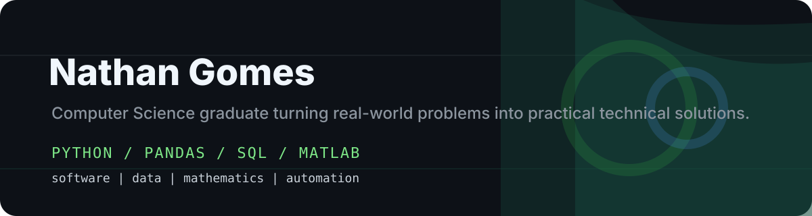

# Nathan Gomes

Aspiring software developer with a passion for data, mathematics, and automation.

I build software and analytics tools that make messy business data easier to trust, explain, and use for decisions. My projects combine data analysis, financial mathematics, and practical automation.

[Portfolio](https://www.nathan-gomes.com) | [LinkedIn](https://www.linkedin.com/in/nathangomes04) | [Email](mailto:nategomes0@gmail.com)

## Core Stack

## What I Am Building

- Financial analytics systems using Python, pandas, SQL, and repeatable reporting workflows
- Portfolio risk tools that combine business assumptions, scenarios, and clear outputs
- Automation and delivery projects using Python, APIs, AWS, Docker, and CI/CD practices
- Project documentation that explains not just what I built, but how the system should be reviewed

## Featured Projects

| Project | Why it matters | Links |
|---|---|---|
| **Quantitative Investment Analytics ETL** | Reproducible Python, pandas, and SQL pipeline for Canadian equity portfolio analytics, transaction-cost simulation, scenario risk analysis, and volatility forecasting | Private repository / [Case study](https://www.nathan-gomes.com/Project-Investment-Analytics.dc.html) / [Interactive report](https://www.nathan-gomes.com/investment-analytics/output/report.html) |
| **Quantitative Portfolio Research Pipeline** | Turns ETF price history into tested portfolio optimization research with returns, volatility, Sharpe ratio, drawdown, VaR, SQL analysis, MATLAB comparison, and walk-forward backtesting | [Repository](https://github.com/Nathan-Gomes/quant-portfolio-research) / [Live report](https://www.nathan-gomes.com/quant-portfolio-report.html) |
| **Multifamily Portfolio Risk App** | Scenario-driven dashboard for property valuation, NOI, DSCR, LTV, CMHC debt exposure, risk watchlists, and capital allocation | [Repository](https://github.com/Nathan-Gomes/multifamily-risk-app) / [Project page](https://www.nathan-gomes.com/Project-Multifamily-Risk-Engine.dc.html) |
| **Cloud Cost Monitor** | Read-only FinOps dashboard for finding cloud waste, idle resources, budget pressure, and rightsizing opportunities | [Repository](https://github.com/Nathan-Gomes/cloud-cost-monitor) / [Project page](https://www.nathan-gomes.com/Project-Cloud-Cost-Monitor.dc.html) |
| **Invoice Review Platform** | Private invoice intelligence platform for document intake, extraction review, approval workflows, anomaly detection, and monthly reporting | Private repository |
| **Agentic AI Economics Research** | Research project comparing token-based AI operating costs with human labour costs across digital workflows | [Repository](https://github.com/Nathan-Gomes/The-Economics-of-Agentic-AI-Token-Cost-Human-Labour-and-the-Future-of-Work) / [Project page](https://www.nathan-gomes.com/Project-Agentic-AI-Economics.dc.html) |

## Technical Areas

| Area | Tools and concepts |
|---|---|
| Data analysis | Python, pandas, NumPy, SciPy, SQL, SQLite, reproducible notebooks |
| Financial analytics | Portfolio optimization, risk metrics, scenario analysis, cash flow, DSCR, LTV, cap rates |
| Automation and delivery | APIs, AWS, Docker, GitHub Actions, Terraform concepts, deployment workflows |
| Software development | FastAPI, REST APIs, JavaScript, TypeScript, React, Next.js, automated tests |

## What I am aiming for

I am looking for junior roles where I can grow through real technical work in software, data, mathematics, and automation while learning from experienced engineering and analytics teams.
